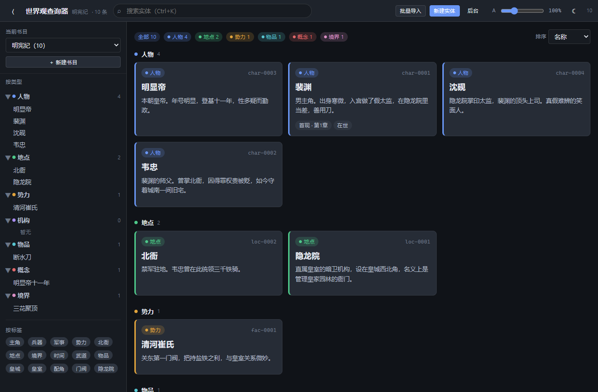
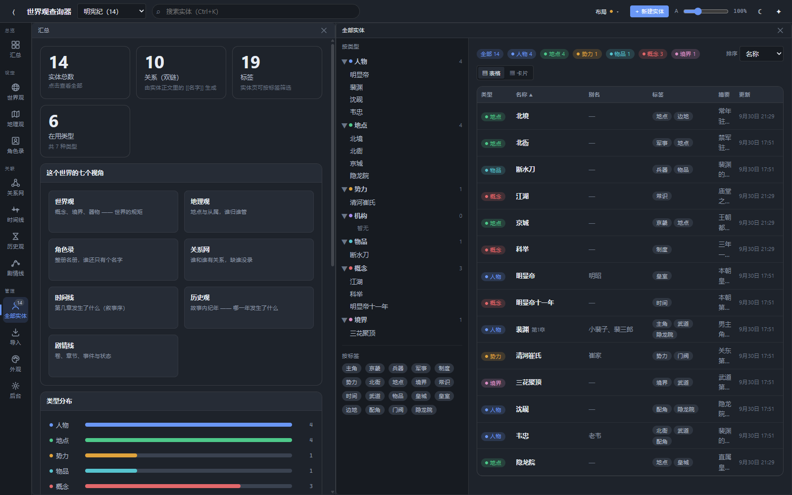
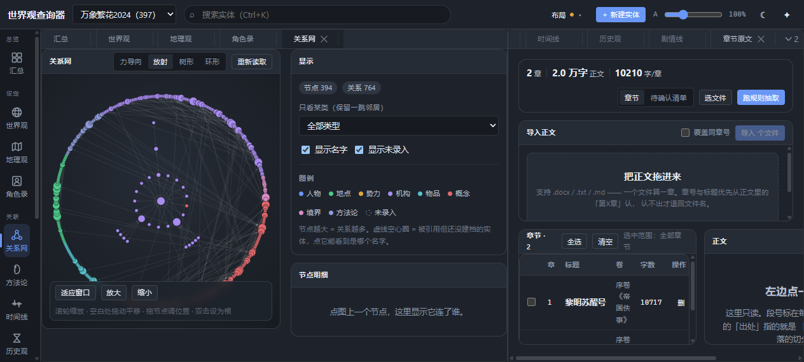
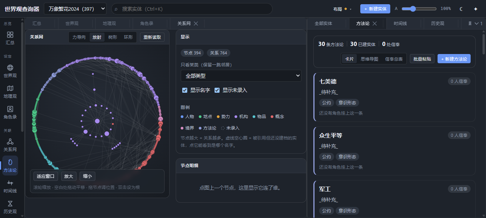
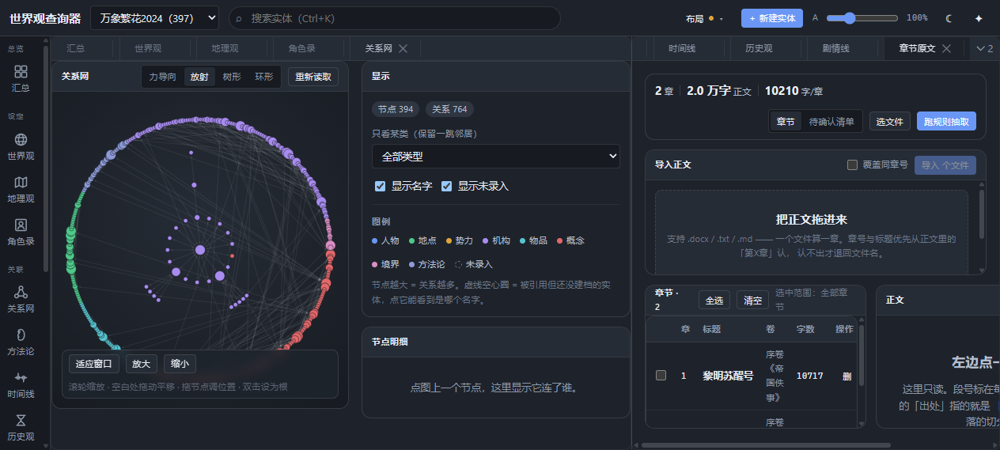

# 世界观查询器 WorldKeeper

> 给小说作者用的**本地世界观资料库**：把散在 docx 和笔记里的人物、势力、地点、
> 伏笔收进一个能搜索、能看图、能核对出处的桌面应用。
>
> **你的正文永远只属于你** —— 本程序只读正文、不写正文，所有数据都存在你自己的硬盘上。

---

## 它解决什么问题

写长篇写到几十万字，设定资料会散成一地：

- 「这个配角上次出场是第几章？」
- 「A 和 B 到底是什么关系，我当时怎么定的？」
- 「第 3 章埋的伏笔，第 27 章收掉了吗？」
- 「这个门派的名字，我第三章写的是不是和第七章不一样？」

世界观查询器把这些变成**一条条带出处的实体卡片**：
每条信息都记着它来自哪一章哪一段、什么时候录入的、置信度多少 —— 三个星期后回来看，依然对得上号。

## 功能一览

| | |
|---|---|
| **实体卡片库** | 人物 / 地点 / 势力 / 机构 / 物品 / 概念 / 境界 / 方法论 8 种内置类型，外加每本书最多 16 种自定义类型 |
| **双链关系** | `[[双链]]` 是关系唯一的真源；改一处，两边的卡片同时更新 |
| **出处永不丢** | 每条信息带 章节 + 段落 + 录入方式 + 时间 + 置信度 |
| **关系网** | 全类型关系图，可拖拽、可图上编辑，另有三维力导向视图 |
| **地理观** | 一层一张图：目录树收纳 + 门户互连，支持空白画布与图片底图 |
| **伏笔追踪** | 伏笔单独建档，AI 抽取的候选先进待确认清单，人工点头才算数 |
| **AI 抽取（可选）** | 用你自己的 API key 从正文里抽实体 / 关系 / 伏笔，**只读正文、永不代写** |
| **快照与回收站** | 删除、合并前自动快照；定时快照；误删可整本回滚 |
| **多书并行** | 多本书互不干扰，每本独立的类型、外观、配置 |
| **搜索** | SQLite FTS5 全文检索，海量实体不卡 |
| **自由布局** | dockview 面板，想怎么摆就怎么摆 |
| **手机访问** | 同一 WiFi 下用手机查设定（默认关闭，设置里开） |

## 界面一览

| | |
|---|---|
|  |  |
| *实体卡片库 —— 按类型分栏，卡片上直接看出场章节与出处* | *默认布局 —— dockview 面板，想怎么摆就怎么摆* |
|  |  |
| *关系网 —— 全类型关系图，可拖拽、可在图上直接编辑* | *方法论 —— 一门功法有哪些人信奉，一图看清* |
|  |  |
| *章节原文 —— 只读对照，点出处直接跳回原文* | *主题 —— 午夜蓝（另有暖纸 / 暖纸浅色 / 图片背景）* |

## 下载安装

到 [**Releases**](../../releases) 页面下载：

- `WorldKeeper-Setup-0.3.0.exe` —— 安装版（推荐），双击安装，许可页点「我接受」
- 绿色版 zip —— 解压即用，不写注册表

**系统要求**：Windows 10 / 11（64 位）。无需安装 Python 或 Node。

> 安装时程序会问你想把**数据目录**放哪 —— 那里存着你的书。卸载程序**默认保留数据**。

## 从源码运行

```bash
# 1. 后端（Python 3.11+）
python -m venv .venv
.venv\Scripts\pip install -r requirements.txt
.venv\Scripts\python -m app.main          # 默认 http://127.0.0.1:8765

# 2. 前端（Node 18+）
cd web
npm install
npm run dev                                # 开发模式，Vite 5173
npm run build                              # 产出 web/dist，由后端直接托管
```

打包 Windows 安装包：

```bash
python packaging/build.py                  # 全量；--skip-deps 用缓存更快
```

## 设计原则

这个工具建立在几条不太容易妥协的规矩上：

1. **正文只读** —— 工具绝不生成、续写、改写正文一个字。AI 只负责「读」。
2. **索引零独占状态** —— SQLite 索引只是 markdown 的派生数据，删掉索引，全量重建即可，书还在。
3. **出处永不丢失** —— 没有出处的设定不可信，所以每条信息都必须能指回原文。
4. **程序目录 ≠ 数据目录** —— 升级、重装、卸载都不碰你的书。
5. **AI 永远只提议** —— AI 抽出来的东西先进「待确认清单」，人工点头才落盘。

## 协议

本项目为**专有软件，保留所有权利**（All rights reserved），见 [LICENSE](LICENSE)。

- 你可以**免费**下载、安装、用它管理自己的小说设定，不限 commercial 或个人用途；
- 但再发行、修改后分发、或将其用于你自己的产品，需要事先取得书面许可；
- **你的数据是你的**：你录入的正文、实体、笔记，权利完全归你，本协议不碰它。

第三方依赖均为 MIT / BSD / Apache-2.0 / MPL-2.0 等宽松协议，
完整清单见包内 `THIRD-PARTY-NOTICES.txt` 与 [docs/licenses.md](docs/licenses.md)。
